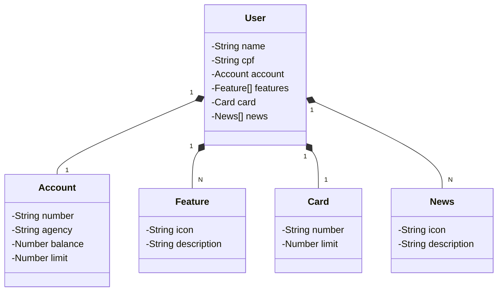

# API RESTful em Java – Projeto Educacional para a Santander Dev Week 2025

Este projeto é uma API backend totalmente educacional desenvolvida durante o **Bootcamp Santander 2025 – Back-End com Java**, oferecido pela **Digital Innovation One (DIO)**.  
Foi criado com o objetivo de demonstrar e aplicar os principais conceitos de Java e Spring Boot, incluindo arquitetura RESTful, injeção de dependência e consumo de APIs.  
O projeto segue princípios de arquitetura limpa e utiliza padrões de projeto comuns para organizar o código de forma clara e eficiente.

---

# Principais Tecnologias
- **Java 17**: Linguagem principal do projeto
- **Spring Boot 3**: Framework para construção da API REST
- **Spring Data JPA**: Persistência com abstração para banco relacional
- **OpenAPI (Swagger)**: Documentação automática da API
- **Railway**: Plataforma para deploy e monitoramento na nuvem

## [Link do Figma](https://www.figma.com/file/0ZsjwjsYlYd3timxqMWlbj/SANTANDER---Projeto-Web%2FMobile?type=design&node-id=1421%3A432&mode=design&t=6dPQuerScEQH0zAn-1)

O Figma foi utilizado para a abstração do domínio desta API, sendo útil na análise e projeto da solução.

---

## Diagrama de Classes (Domínio da API)



---

## Documentação da API (Swagger)

Clique Acesse a documentação funcional e interativa da API clicando [aqui](https://santander-api-jv.up.railway.app/swagger-ui/index.html).

---

## 2. Endpoints da API

```markdown
## API Endpoints

| Método | Endpoint       | Descrição                      |
|--------|----------------|-------------------------------|
| GET    | /v1/users      | Lista todos os usuários        |
| GET    | /v1/users/{id} | Consulta usuário por ID        |
| POST   | /v1/users      | Cria um novo usuário           |
| PUT    | /v1/users/{id} | Atualiza usuário existente     |
| DELETE | /v1/users/{id} | Remove usuário                 |
```

## Tratamento de Erros

- `422 Unprocessable Entity` – Dados enviados com formato inválido ou violando restrições básicas
- `409 Conflict` – CPF, número de conta ou cartão já cadastrados no sistema
- `404 Not Found` – Recurso não encontrado (ex: usuário inexistente)
- `500 Internal Server Error` – Erro inesperado no servidor


### Exemplo de requisição POST (JSON) 

```json
{
  "name": "John Doe",
  "cpf": "00000011111",
  "account": {
    "number": "1234-56",
    "agency": "123456-7",
    "balance": 800.00,
    "limit": 5000.00
  },
  "card": {
    "number": "1111 2222 3333 4444",
    "limit": 2500.50
  },
  "features": [
    {
      "icon": "https://some.feature.icon.com/png",
      "description": "Feature description"
    }
  ],
  "news": [
    {
      "icon": "https://some.news.icon.com/png",
      "description": "News description"
    }
  ]
}
```
Modelo de requisição JSON disponível no arquivo ```request-model.json```.